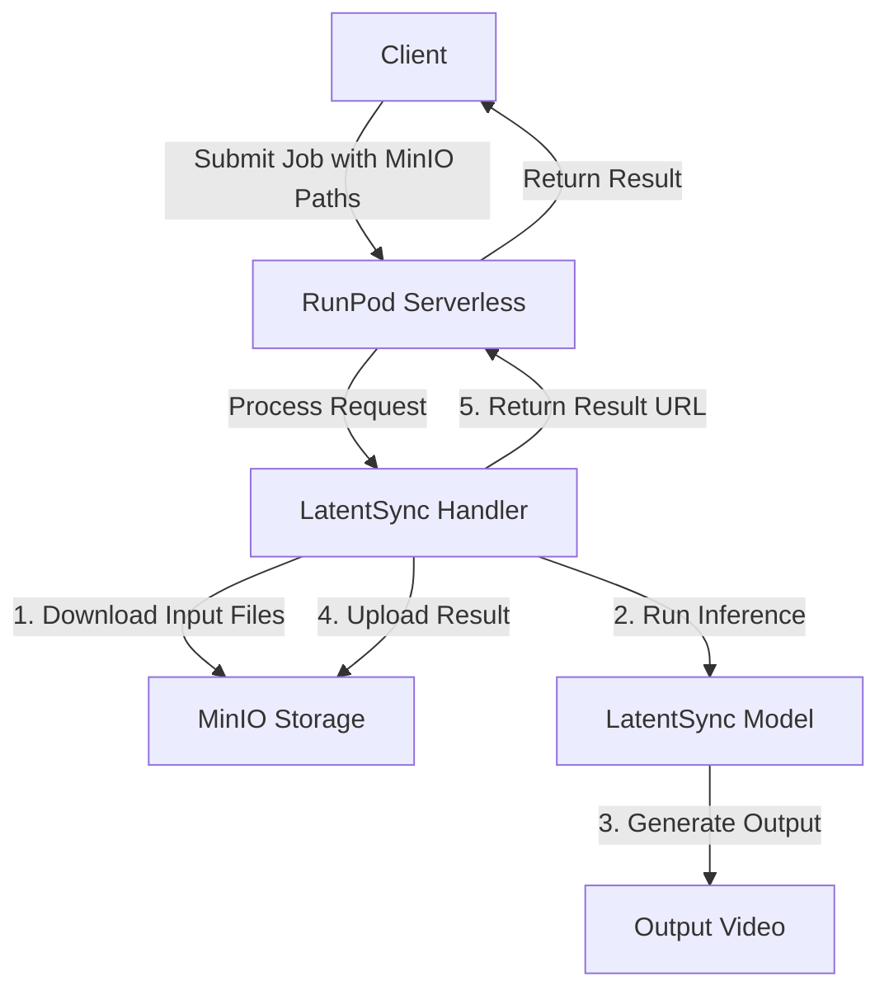

# Plan for Deploying LatentSync Inference on RunPod Serverless

## Overview

We'll create a Docker image that includes all necessary code, dependencies, and model files to run the LatentSync inference on RunPod serverless. The service will accept MinIO paths for input files and upload the results to the specified MinIO location.

## Architecture



## Implementation Steps

### 1. Create a .env File for MinIO Credentials

Create a .env file with the following content:

```
MINIO_ENDPOINT=https://minio.xenoumena.com
MINIO_ACCESS_KEY=YOUR_ACCESS_KEY
MINIO_SECRET_KEY=YOUR_SECRET_KEY
MINIO_BUCKET=latentsync
```

### 2. Create a Custom Handler for RunPod

We'll modify the existing handler.py to:
- Accept MinIO paths for input video and audio
- Download the input files using MinIO client
- Run the inference using the existing scripts/inference.py
- Upload the output to the specified MinIO location
- Return the URL or path to the output file

### 3. Create a Dockerfile

The Dockerfile will:
- Use the RunPod base image with CUDA support
- Install all dependencies using uv (as recommended by RunPod)
- Copy the necessary code and model files
- Copy the .env file and set up the environment
- Configure the RunPod handler

### 4. Build and Push the Docker Image

We'll build the Docker image and push it to a registry where RunPod can access it.

### 5. Deploy on RunPod

We'll create a new serverless endpoint on RunPod using the Docker image.

## Detailed Implementation

### 1. .env File

```
MINIO_ENDPOINT=https://minio.xenoumena.com
MINIO_ACCESS_KEY=YOUR_ACCESS_KEY
MINIO_SECRET_KEY=YOUR_SECRET_KEY
MINIO_BUCKET=latentsync
```

### 2. Custom Handler Implementation

Here's how we'll modify the handler.py file:

```python
"""LatentSync inference handler for RunPod."""

import os
import runpod
import subprocess
import tempfile
import shutil
from minio import Minio
from minio.error import S3Error
from dotenv import load_dotenv
import urllib.parse

# Load environment variables from .env file
load_dotenv()

# MinIO configuration
MINIO_ENDPOINT = os.getenv("MINIO_ENDPOINT")
MINIO_ACCESS_KEY = os.getenv("MINIO_ACCESS_KEY")
MINIO_SECRET_KEY = os.getenv("MINIO_SECRET_KEY")
MINIO_BUCKET = os.getenv("MINIO_BUCKET")

# Initialize MinIO client
minio_client = Minio(
    MINIO_ENDPOINT.replace("https://", "").replace("http://", ""),
    access_key=MINIO_ACCESS_KEY,
    secret_key=MINIO_SECRET_KEY,
    secure=MINIO_ENDPOINT.startswith("https")
)

# Load models into memory
# This will be executed once when the container starts
# and will be cached for subsequent requests
def load_models():
    print("Loading models into memory...")
    # You can add any model loading code here if needed
    # For example, if there are parts of the model that can be pre-loaded
    # to make inference faster
    print("Models loaded successfully")

# Initialize models
load_models()

def download_from_minio(minio_path, local_path):
    """Download a file from MinIO to a local path."""
    try:
        # Parse MinIO path
        if minio_path.startswith('minio://'):
            minio_path = minio_path[8:]
        
        # Extract bucket and object name
        bucket_name = MINIO_BUCKET
        object_name = minio_path
        
        # Download file
        minio_client.fget_object(bucket_name, object_name, local_path)
        return True
    except S3Error as e:
        print(f"Error downloading from MinIO: {str(e)}")
        return False

def upload_to_minio(local_path, minio_path):
    """Upload a file from a local path to MinIO."""
    try:
        # Parse MinIO path
        if minio_path.startswith('minio://'):
            minio_path = minio_path[8:]
        
        # Extract bucket and object name
        bucket_name = MINIO_BUCKET
        object_name = minio_path
        
        # Upload file
        minio_client.fput_object(bucket_name, object_name, local_path)
        return f"minio://{bucket_name}/{object_name}"
    except S3Error as e:
        print(f"Error uploading to MinIO: {str(e)}")
        return None

def handler(job):
    """Handler function that will be used to process jobs."""
    job_input = job["input"]
    
    # Create a temporary directory for processing
    temp_dir = tempfile.mkdtemp()
    try:
        # Get input parameters
        video_path = job_input.get("video_path")
        audio_path = job_input.get("audio_path")
        output_path = job_input.get("output_path")
        guidance_scale = job_input.get("guidance_scale", 1.0)
        seed = job_input.get("seed", 1247)
        
        if not video_path or not audio_path or not output_path:
            return {"error": "Missing required parameters: video_path, audio_path, or output_path"}
        
        # Download input files
        local_video_path = os.path.join(temp_dir, "input_video.mp4")
        local_audio_path = os.path.join(temp_dir, "input_audio.wav")
        local_output_path = os.path.join(temp_dir, "output_video.mp4")
        
        print(f"Downloading video from {video_path}")
        if not download_from_minio(video_path, local_video_path):
            return {"error": f"Failed to download video from {video_path}"}
        
        print(f"Downloading audio from {audio_path}")
        if not download_from_minio(audio_path, local_audio_path):
            return {"error": f"Failed to download audio from {audio_path}"}
        
        # Run inference
        print("Running inference")
        inference_command = [
            "python", "-m", "scripts.inference",
            "--unet_config_path", "configs/unet/stage2.yaml",
            "--inference_ckpt_path", "checkpoints/latentsync_unet.pt",
            "--video_path", local_video_path,
            "--audio_path", local_audio_path,
            "--video_out_path", local_output_path,
            "--guidance_scale", str(guidance_scale),
            "--seed", str(seed)
        ]
        
        process = subprocess.run(
            inference_command,
            stdout=subprocess.PIPE,
            stderr=subprocess.PIPE,
            text=True
        )
        
        if process.returncode != 0:
            return {
                "error": f"Inference failed with exit code {process.returncode}",
                "stderr": process.stderr
            }
        
        # Upload output file
        print(f"Uploading output to {output_path}")
        output_url = upload_to_minio(local_output_path, output_path)
        if not output_url:
            return {"error": f"Failed to upload output to {output_path}"}
        
        # Return result
        return {
            "output_url": output_url,
            "stdout": process.stdout,
            "stderr": process.stderr
        }
    
    finally:
        # Clean up temporary directory
        shutil.rmtree(temp_dir)

# Start the serverless function
runpod.serverless.start({"handler": handler})
```

### 3. Dockerfile

```dockerfile
FROM runpod/base:0.6.3-cuda11.8.0

# Set working directory
WORKDIR /app

# Set python3.11 as the default python
RUN ln -sf $(which python3.11) /usr/local/bin/python && \
    ln -sf $(which python3.11) /usr/local/bin/python3

# Install system dependencies
RUN apt-get update && apt-get install -y \
    ffmpeg \
    libgl1 \
    && rm -rf /var/lib/apt/lists/*

# Copy requirements and install Python dependencies
COPY requirements.txt /requirements.txt
RUN uv pip install --upgrade -r /requirements.txt --no-cache-dir --system

# Add additional dependencies for MinIO
RUN uv pip install minio python-dotenv --no-cache-dir --system

# Copy necessary code and configs
COPY scripts/ /app/scripts/
COPY latentsync/ /app/latentsync/
COPY configs/ /app/configs/
COPY checkpoints/ /app/checkpoints/
COPY .env /app/.env
COPY handler.py /app/

# Set environment variables
ENV PYTHONPATH=/app

# Run the handler
CMD ["python", "-u", "/app/handler.py"]
```

### 4. Input/Output Format

The RunPod serverless endpoint will accept the following input format:

```json
{
  "video_path": "path/to/input_video.mp4",
  "audio_path": "path/to/input_audio.wav",
  "output_path": "path/to/output_video.mp4",
  "guidance_scale": 1.5,
  "seed": 1247
}
```

And will return the following output format:

```json
{
  "output_url": "minio://latentsync/path/to/output_video.mp4",
  "stdout": "...",
  "stderr": "..."
}
```

## Next Steps

1. Create the .env file with your MinIO credentials
2. Implement the custom handler
3. Create the Dockerfile
4. Test locally
5. Build and push the Docker image
6. Deploy on RunPod

## Additional Considerations

1. **Error Handling**: The handler includes basic error handling, but you may want to add more robust error handling for production use.
2. **Logging**: Consider adding more detailed logging to help with debugging.
3. **Security**: Ensure that your MinIO credentials are kept secure and not exposed in the Docker image.
4. **Scaling**: RunPod allows you to configure the number of workers and the resources allocated to each worker. Adjust these settings based on your needs.