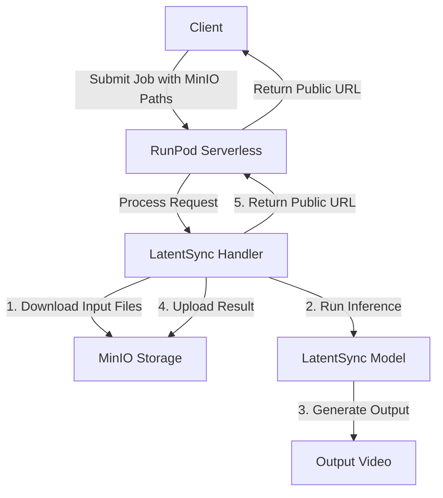

# Plan for Deploying LatentSync Inference on RunPod Serverless

## Overview

We'll create a Docker image that includes all necessary code, dependencies, and model files to run the LatentSync inference on RunPod serverless. The service will accept MinIO paths for input files and upload the results to the specified MinIO location, returning a shareable downloadable public link.

## Architecture



## Implementation Steps

### 1. Create a .env File for MinIO Credentials

Create a .env file with the following content:

```
MINIO_ENDPOINT=https://minio.xenoumena.com
MINIO_ACCESS_KEY=YOUR_ACCESS_KEY
MINIO_SECRET_KEY=YOUR_SECRET_KEY
MINIO_BUCKET=latentsync
```

### 2. Create a Custom Handler for RunPod

We'll modify the existing handler.py to:
- Accept MinIO paths for input video and audio
- Download the input files using MinIO client
- Run the inference using the existing scripts/inference.py
- Upload the output to the specified MinIO location
- Generate and return a shareable public URL for the output file

### 3. Create a Dockerfile

The Dockerfile will:
- Use the RunPod base image with CUDA support
- Install all dependencies using uv (as recommended by RunPod)
- Copy the necessary code and model files
- Copy the .env file and set up the environment
- Configure the RunPod handler

### 4. Build and Push the Docker Image

We'll build the Docker image and push it to a registry where RunPod can access it.

### 5. Deploy on RunPod

We'll create a new serverless endpoint on RunPod using the Docker image.

## Detailed Implementation

### 1. .env File

```
MINIO_ENDPOINT=https://minio.xenoumena.com
MINIO_ACCESS_KEY=YOUR_ACCESS_KEY
MINIO_SECRET_KEY=YOUR_SECRET_KEY
MINIO_BUCKET=latentsync
```

### 2. Preloading Models

Based on the inference.py script, we can preload the following models into memory when the container starts:

1. **Scheduler**: The DDIM scheduler from the configs directory
2. **Whisper Model**: Either small.pt or tiny.pt depending on the config
3. **VAE Model**: The stabilityai/sd-vae-ft-mse model
4. **Denoising UNet**: The main model from the checkpoint path

Preloading these models will significantly reduce the inference time for each request.

### 3. Custom Handler Implementation

Here's how we'll modify the handler.py file:

```python
"""LatentSync inference handler for RunPod."""

import os
import runpod
import subprocess
import tempfile
import shutil
import time
from minio import Minio
from minio.error import S3Error
from dotenv import load_dotenv
import urllib.parse
import torch
from omegaconf import OmegaConf
from diffusers import AutoencoderKL, DDIMScheduler
from latentsync.models.unet import UNet3DConditionModel
from latentsync.whisper.audio2feature import Audio2Feature

# Load environment variables from .env file
load_dotenv()

# MinIO configuration
MINIO_ENDPOINT = os.getenv("MINIO_ENDPOINT")
MINIO_ACCESS_KEY = os.getenv("MINIO_ACCESS_KEY")
MINIO_SECRET_KEY = os.getenv("MINIO_SECRET_KEY")
MINIO_BUCKET = os.getenv("MINIO_BUCKET")

# Initialize MinIO client
minio_client = Minio(
    MINIO_ENDPOINT.replace("https://", "").replace("http://", ""),
    access_key=MINIO_ACCESS_KEY,
    secret_key=MINIO_SECRET_KEY,
    secure=MINIO_ENDPOINT.startswith("https")
)

# Ensure bucket exists
if not minio_client.bucket_exists(MINIO_BUCKET):
    minio_client.make_bucket(MINIO_BUCKET)
    # Set bucket policy to allow public read access
    policy = {
        "Version": "2012-10-17",
        "Statement": [
            {
                "Effect": "Allow",
                "Principal": {"AWS": "*"},
                "Action": ["s3:GetObject"],
                "Resource": [f"arn:aws:s3:::{MINIO_BUCKET}/*"]
            }
        ]
    }
    minio_client.set_bucket_policy(MINIO_BUCKET, json.dumps(policy))

# Global variables for preloaded models
global_config = None
global_scheduler = None
global_vae = None
global_audio_encoder = None
global_denoising_unet = None

# Load models into memory
def load_models():
    """Preload models into memory to speed up inference."""
    global global_config, global_scheduler, global_vae, global_audio_encoder, global_denoising_unet
    
    print("Loading models into memory...")
    
    # Load config
    config_path = "configs/unet/stage2.yaml"
    global_config = OmegaConf.load(config_path)
    
    # Check if GPU supports float16
    is_fp16_supported = torch.cuda.is_available() and torch.cuda.get_device_capability()[0] > 7
    dtype = torch.float16 if is_fp16_supported else torch.float32
    
    # Load scheduler
    global_scheduler = DDIMScheduler.from_pretrained("configs")
    
    # Load VAE
    global_vae = AutoencoderKL.from_pretrained("stabilityai/sd-vae-ft-mse", torch_dtype=dtype)
    global_vae.config.scaling_factor = 0.18215
    global_vae.config.shift_factor = 0
    
    # Determine which whisper model to use based on config
    if global_config.model.cross_attention_dim == 768:
        whisper_model_path = "checkpoints/whisper/small.pt"
    elif global_config.model.cross_attention_dim == 384:
        whisper_model_path = "checkpoints/whisper/tiny.pt"
    else:
        raise NotImplementedError("cross_attention_dim must be 768 or 384")
    
    # Load audio encoder
    global_audio_encoder = Audio2Feature(
        model_path=whisper_model_path,
        device="cuda",
        num_frames=global_config.data.num_frames,
        audio_feat_length=global_config.data.audio_feat_length,
    )
    
    # Load denoising UNet
    inference_ckpt_path = "checkpoints/latentsync_unet.pt"
    global_denoising_unet, _ = UNet3DConditionModel.from_pretrained(
        OmegaConf.to_container(global_config.model),
        inference_ckpt_path,
        device="cuda",
    )
    global_denoising_unet = global_denoising_unet.to(dtype=dtype)
    
    print("Models loaded successfully")

# Initialize models
load_models()

def download_from_minio(minio_path, local_path):
    """Download a file from MinIO to a local path."""
    try:
        # Parse MinIO path
        if minio_path.startswith('minio://'):
            minio_path = minio_path[8:]
        
        # Extract bucket and object name
        bucket_name = MINIO_BUCKET
        object_name = minio_path
        
        # Download file
        minio_client.fget_object(bucket_name, object_name, local_path)
        return True
    except S3Error as e:
        print(f"Error downloading from MinIO: {str(e)}")
        return False

def upload_to_minio(local_path, minio_path):
    """Upload a file from a local path to MinIO and return a public URL."""
    try:
        # Parse MinIO path
        if minio_path.startswith('minio://'):
            minio_path = minio_path[8:]
        
        # Extract bucket and object name
        bucket_name = MINIO_BUCKET
        object_name = minio_path
        
        # Upload file
        minio_client.fput_object(bucket_name, object_name, local_path)
        
        # Generate a presigned URL that expires in 7 days (604800 seconds)
        url = minio_client.presigned_get_object(
            bucket_name, 
            object_name,
            expires=604800
        )
        
        return url
    except S3Error as e:
        print(f"Error uploading to MinIO: {str(e)}")
        return None

def run_inference(video_path, audio_path, output_path, guidance_scale=1.0, seed=1247):
    """Run inference using the preloaded models."""
    global global_config, global_scheduler, global_vae, global_audio_encoder, global_denoising_unet
    
    # Check if the GPU supports float16
    is_fp16_supported = torch.cuda.is_available() and torch.cuda.get_device_capability()[0] > 7
    dtype = torch.float16 if is_fp16_supported else torch.float32
    
    # Create pipeline
    from latentsync.pipelines.lipsync_pipeline import LipsyncPipeline
    pipeline = LipsyncPipeline(
        vae=global_vae,
        audio_encoder=global_audio_encoder,
        denoising_unet=global_denoising_unet,
        scheduler=global_scheduler,
    ).to("cuda")
    
    # Set seed
    if seed != -1:
        from accelerate.utils import set_seed
        set_seed(seed)
    else:
        torch.seed()
    
    print(f"Initial seed: {torch.initial_seed()}")
    
    # Run inference
    pipeline(
        video_path=video_path,
        audio_path=audio_path,
        video_out_path=output_path,
        video_mask_path=output_path.replace(".mp4", "_mask.mp4"),
        num_frames=global_config.data.num_frames,
        num_inference_steps=20,  # Default value from inference.py
        guidance_scale=guidance_scale,
        weight_dtype=dtype,
        width=global_config.data.resolution,
        height=global_config.data.resolution,
        mask_image_path=global_config.data.mask_image_path,
    )
    
    return True

def handler(job):
    """Handler function that will be used to process jobs."""
    job_input = job["input"]
    
    # Create a temporary directory for processing
    temp_dir = tempfile.mkdtemp()
    try:
        # Get input parameters
        video_path = job_input.get("video_path")
        audio_path = job_input.get("audio_path")
        output_path = job_input.get("output_path")
        guidance_scale = float(job_input.get("guidance_scale", 1.0))
        seed = int(job_input.get("seed", 1247))
        
        if not video_path or not audio_path or not output_path:
            return {"error": "Missing required parameters: video_path, audio_path, or output_path"}
        
        # Download input files
        local_video_path = os.path.join(temp_dir, "input_video.mp4")
        local_audio_path = os.path.join(temp_dir, "input_audio.wav")
        local_output_path = os.path.join(temp_dir, "output_video.mp4")
        
        print(f"Downloading video from {video_path}")
        if not download_from_minio(video_path, local_video_path):
            return {"error": f"Failed to download video from {video_path}"}
        
        print(f"Downloading audio from {audio_path}")
        if not download_from_minio(audio_path, local_audio_path):
            return {"error": f"Failed to download audio from {audio_path}"}
        
        # Run inference
        print("Running inference")
        start_time = time.time()
        
        success = run_inference(
            video_path=local_video_path,
            audio_path=local_audio_path,
            output_path=local_output_path,
            guidance_scale=guidance_scale,
            seed=seed
        )
        
        if not success:
            return {"error": "Inference failed"}
        
        inference_time = time.time() - start_time
        print(f"Inference completed in {inference_time:.2f} seconds")
        
        # Upload output file
        print(f"Uploading output to {output_path}")
        output_url = upload_to_minio(local_output_path, output_path)
        if not output_url:
            return {"error": f"Failed to upload output to {output_path}"}
        
        # Return result
        return {
            "output_url": output_url,
            "inference_time": inference_time
        }
    
    finally:
        # Clean up temporary directory
        shutil.rmtree(temp_dir)

# Start the serverless function
runpod.serverless.start({"handler": handler})
```

### 4. Dockerfile

```dockerfile
FROM runpod/base:0.6.3-cuda11.8.0

# Set working directory
WORKDIR /app

# Set python3.11 as the default python
RUN ln -sf $(which python3.11) /usr/local/bin/python && \
    ln -sf $(which python3.11) /usr/local/bin/python3

# Install system dependencies
RUN apt-get update && apt-get install -y \
    ffmpeg \
    libgl1 \
    && rm -rf /var/lib/apt/lists/*

# Copy requirements and install Python dependencies
COPY requirements.txt /requirements.txt
RUN uv pip install --upgrade -r /requirements.txt --no-cache-dir --system

# Add additional dependencies for MinIO
RUN uv pip install minio python-dotenv --no-cache-dir --system

# Copy necessary code and configs
COPY scripts/ /app/scripts/
COPY latentsync/ /app/latentsync/
COPY configs/ /app/configs/
COPY checkpoints/ /app/checkpoints/
COPY .env /app/.env
COPY handler.py /app/

# Set environment variables
ENV PYTHONPATH=/app

# Run the handler
CMD ["python", "-u", "/app/handler.py"]
```

### 5. Input/Output Format

The RunPod serverless endpoint will accept the following input format:

```json
{
  "video_path": "path/to/input_video.mp4",
  "audio_path": "path/to/input_audio.wav",
  "output_path": "path/to/output_video.mp4",
  "guidance_scale": 1.5,
  "seed": 1247
}
```

And will return the following output format:

```json
{
  "output_url": "https://minio.xenoumena.com/latentsync/path/to/output_video.mp4?X-Amz-Algorithm=...",
  "inference_time": 12.34
}
```

## Next Steps

1. Create the .env file with your MinIO credentials
2. Implement the custom handler
3. Create the Dockerfile
4. Test locally
5. Build and push the Docker image
6. Deploy on RunPod

## Additional Considerations

1. **Error Handling**: The handler includes basic error handling, but you may want to add more robust error handling for production use.
2. **Logging**: Consider adding more detailed logging to help with debugging.
3. **Security**: Ensure that your MinIO credentials are kept secure and not exposed in the Docker image.
4. **Scaling**: RunPod allows you to configure the number of workers and the resources allocated to each worker. Adjust these settings based on your needs.
5. **Caching**: The models are preloaded into memory to speed up inference, but you may want to add additional caching mechanisms for frequently used inputs.